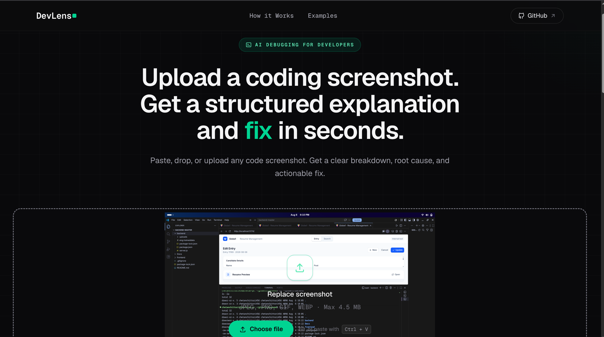
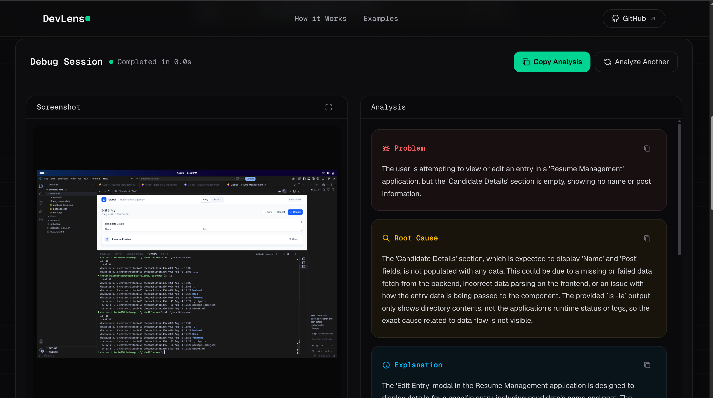
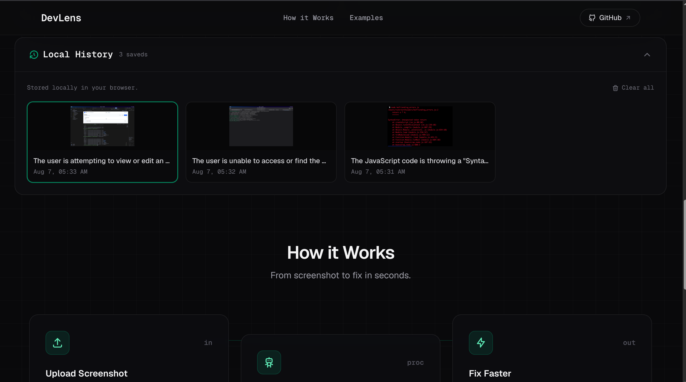
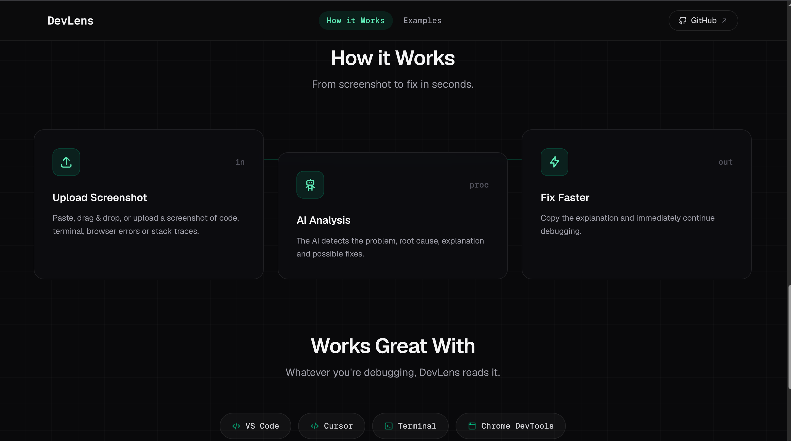

# DevLens

**AI-powered debugging for developers.** Paste, drop, or upload a screenshot of your code, terminal, browser console, or stack trace — DevLens analyzes it and returns a structured debugging report with the problem, root cause, explanation, and suggested fix in seconds.

<p align="center">
  
</p>

---

## Features

- **Paste, drag & drop, or upload** screenshots — JPEG, PNG, GIF, and WEBP (max 4.5 MB)
- **Structured debugging output** — Problem, Root Cause, Explanation, and Suggested Fix
- **Suggested code** — corrected snippets or exact commands, ready to copy
- **One-click copy** — copy any section or the full analysis
- **Local history** — previous analyses are stored in your browser and never leave your machine
- **Works with** VS Code, Cursor, terminals, Chrome DevTools, browser consoles, React, Next.js, Python, stack traces, and more
- **Privacy-first** — no accounts, no cloud storage, no server-side persistence

---

## AI Analysis

Every screenshot is analyzed by Google Gemini through the Vercel AI SDK, producing a structured report you can act on immediately:

| Output | What you get |
| --- | --- |
| **Problem** | A one-sentence summary of what's wrong |
| **Root Cause** | Why it's happening, with references to the code |
| **Explanation** | The full context, written to be understood fast |
| **Suggested Fix** | Step-by-step instructions, commands, and corrected code |

<p align="center">
  
</p>

---

## Local History

Every analysis is saved locally in your browser (localStorage) — up to 50 sessions. Revisit past debugging sessions with a single click, without uploading anything again. Your screenshots and analyses never touch a database.

<p align="center">
  
</p>

---

## How It Works

1. **Upload** — paste, drop, or select a screenshot
2. **AI analyzes** — Gemini detects the problem and root cause
3. **Copy & continue** — grab the fix and get back to coding

<p align="center">
  
</p>

---

## Tech Stack

- **[Next.js 16](https://nextjs.org)** — App Router, React 19, TypeScript
- **[Vercel AI SDK](https://sdk.vercel.ai)** — structured object generation with **[Google Gemini 2.5 Flash](https://ai.google.dev/gemini-api/docs/models/gemini)**
- **[Tailwind CSS v4](https://tailwindcss.com)** — styling
- **[Motion](https://motion.dev)** — scroll and entrance animations
- **[Zod](https://zod.dev)** — typed response schema
- **[Tabler Icons](https://tabler.io/icons)** — UI icons
- **[Sonner](https://sonner.emilkowal.ski)** — toasts

---

## Installation

```bash
git clone https://github.com/<your-username>/devlens.git
cd devlens
npm install
npm run dev
```

Open [http://localhost:3000](http://localhost:3000). You'll need a Google API key — see below.

> **NOTE:** Screenshots are sent to the Gemini API for analysis. They are not stored on the server.

---

## Environment Variables

Copy `.env.example` to `.env.local` and fill in your values:

| Variable | Required | Description |
| --- | --- | --- |
| `GOOGLE_GENERATIVE_AI_API_KEY` | ✅ | Google Gemini API key from [AI Studio](https://aistudio.google.com/apikey) |

---

## Project Structure

```
app/
├── api/route.ts        # POST /api — image analysis endpoint (Gemini)
├── components/         # UI components (Navbar, Hero, UploadArea, ResultsSection, …)
├── clipboard.ts        # Cross-browser clipboard helper
├── utils.ts            # Zod schema, image validation, history helpers
├── globals.css         # Tailwind theme + custom animations
├── layout.tsx          # Root layout + metadata
└── page.tsx            # Home page — upload flow and state
```

---

## Roadmap

- [ ] Better OCR accuracy for complex UI screenshots
- [ ] Multiple AI providers (OpenAI, Anthropic, local models)
- [ ] Export analysis as Markdown / PDF
- [ ] Optional authentication
- [ ] Cloud-synced history
- [ ] Mobile UX improvements

---

## Contributing

Contributions are welcome, whether it's a bug report, a UI tweak, or a new feature.

1. Fork the repository
2. Create a branch: `git checkout -b feat/my-feature`
3. Commit your changes: `git commit -m "feat: add my feature"`
4. Push to the branch: `git push origin feat/my-feature`
5. Open a pull request

Please keep changes focused and run `npm run build` before submitting.

---

## License

[MIT](./LICENSE)
